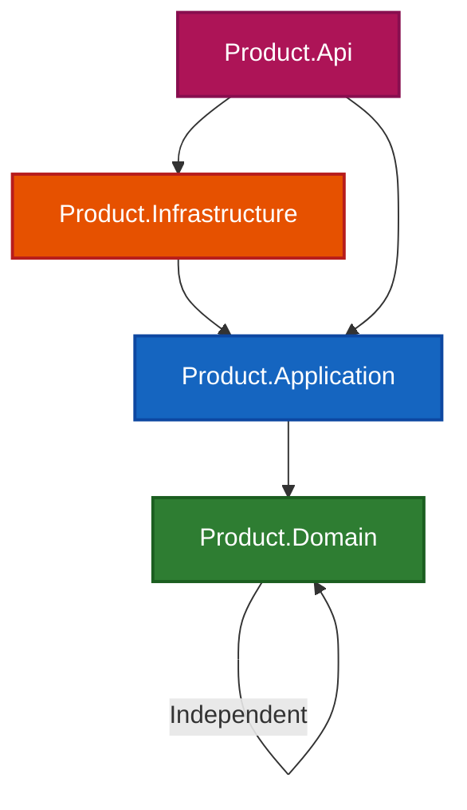
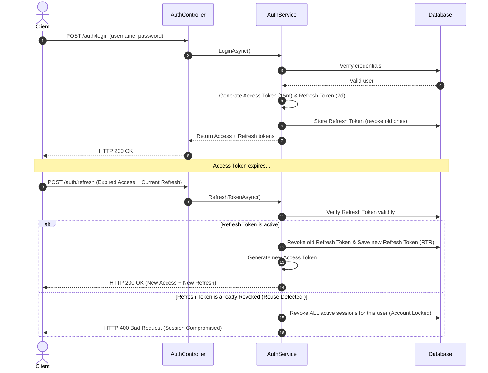
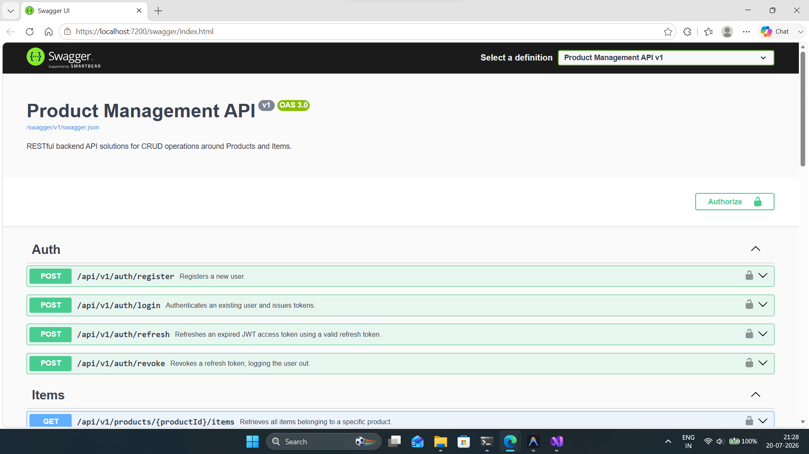
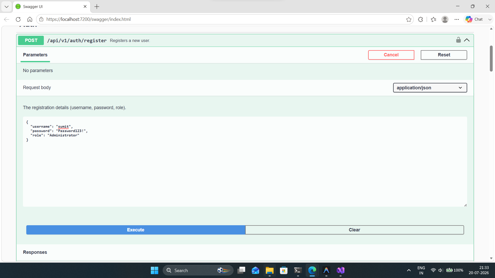
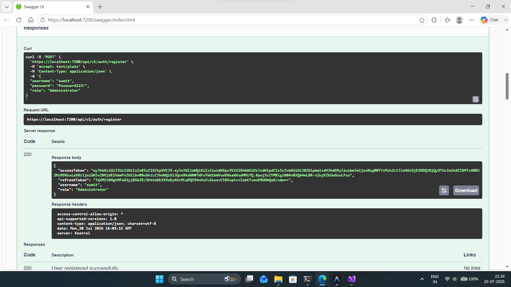
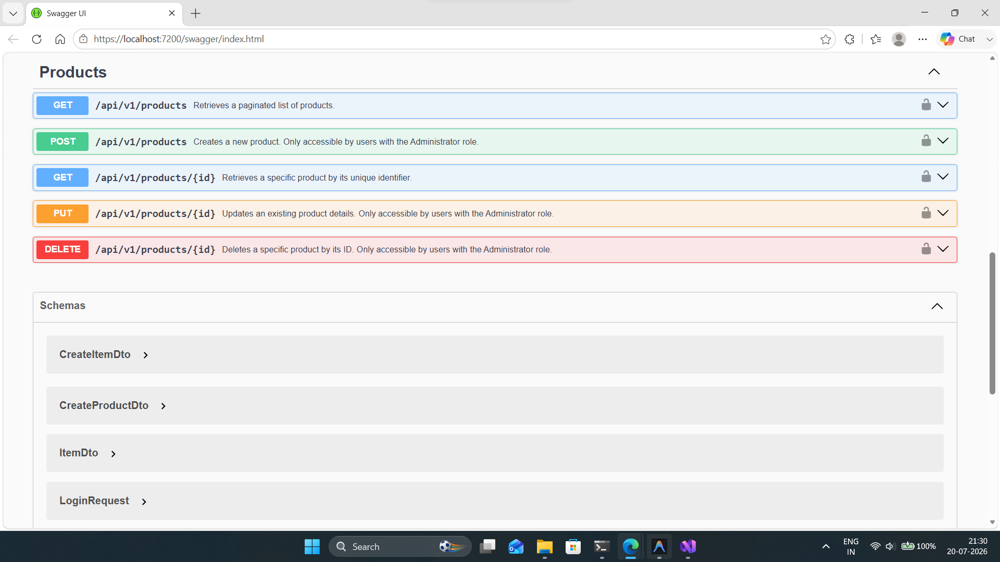
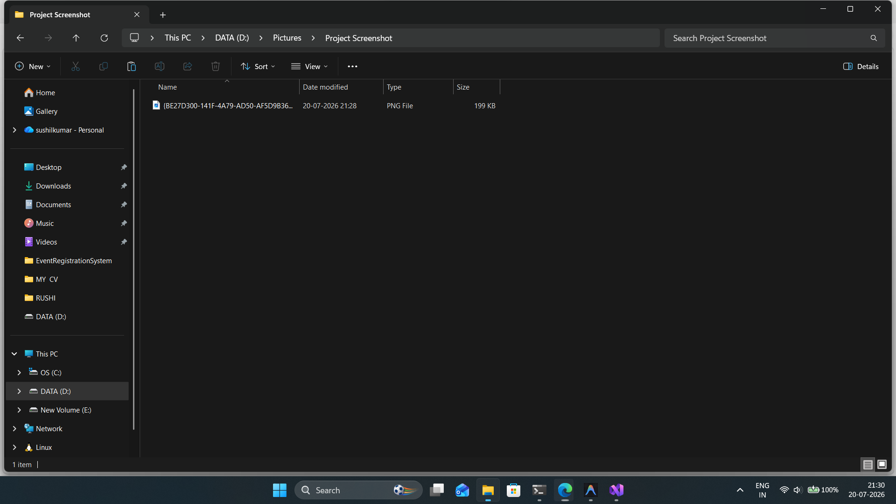
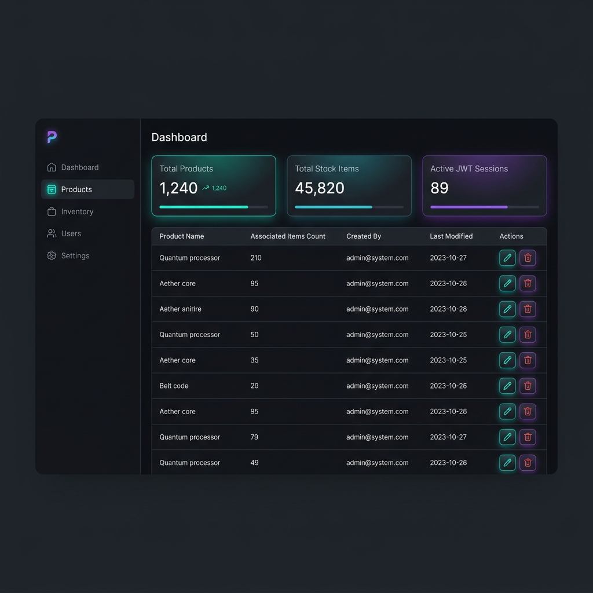

# Product Management API

[](https://dotnet.microsoft.com/en-us/download/dotnet/8.0)
[](https://www.docker.com/)
[](https://learn.microsoft.com/en-us/ef/core/)
[](https://www.microsoft.com/en-us/sql-server/)
[](https://jwt.io/)

A robust, enterprise-grade ASP.NET Core 8 Web API solution designed for managing products and their associated stock items. This project incorporates Clean Architecture principles, Entity Framework Core with automated migrations, Role-Based Access Control (RBAC), and JWT-based authentication featuring secure Access/Refresh Token Rotation (RTR).

---

## 📖 Table of Contents
1. [Project Overview](#-project-overview)
2. [Features](#-features)
3. [Tech Stack](#-tech-stack)
4. [Architecture](#-architecture)
5. [Folder Structure](#-folder-structure)
6. [Database Setup](#-database-setup)
7. [How to Run](#-how-to-run)
8. [Docker Instructions](#-docker-instructions)
9. [Authentication Flow](#-authentication-flow)
10. [API Endpoints](#-api-endpoints)
11. [Swagger Screenshot](#-swagger-screenshot)
12. [Project Screenshots](#-project-screenshots)
13. [Future Improvements](#-future-improvements)

---

## 🔍 Project Overview

The **Product Management API** serves as a secure, scalable backend system to manage catalog products and inventory items. It implements a decoupled, maintainable structure where business rules are isolated from infrastructure details, databases, and UI layers. By utilizing ASP.NET Core 8, the API provides high throughput, cross-platform deployment capability, and robust developer experiences through interactive Swagger documentation.

---

## 🌟 Features

* **Clean Architecture**: Deep separation of concerns into Domain, Application, Infrastructure, and Presentation (Web API) projects.
* **Access/Refresh Token Rotation (RTR)**: Highly secure token rotation strategy ensuring short-lived access tokens (15 mins) and one-time use refresh tokens (7 days) with reuse detection.
* **Role-Based Access Control (RBAC)**: Fine-grained access level permissions separating standard users (read-only operations) and Administrators (authorized for all CRUD operations).
* **Automated Migrations & Auditing**: Automatic Entity Framework Core migrations on startup, and automatic auditing of `CreatedBy`/`CreatedOn` and `ModifiedBy`/`ModifiedOn` properties using DbContext hooks.
* **FluentValidation**: Strong request validation using FluentValidation integrated into ASP.NET Core action filters.
* **AutoMapper**: Automatic DTO mapping mapping Domain entities to clean application data transfer objects.
* **Serilog Logging**: Comprehensive logging to Console with minimum level overrides.
* **Comprehensive Test Suite**: Unit and integration test coverage across application layers using xUnit.

---

## 🛠️ Tech Stack

* **Language**: C# 12
* **Framework**: .NET 8.0 SDK
* **Database**: Microsoft SQL Server / LocalDB
* **ORM**: Entity Framework Core 8
* **Authentication**: JWT Bearer Tokens with custom rotation
* **Validation**: FluentValidation
* **Object Mapping**: AutoMapper 13
* **Logging**: Serilog
* **API Versioning**: ASP.NET Core API Versioning (v1.0)
* **Testing**: xUnit, FluentAssertions, Moq, Microsoft.AspNetCore.Mvc.Testing
* **Containerization**: Docker, Docker Compose

---

## 📐 Architecture

This project is built using **Clean Architecture** principles. The layers are structured as follows:



### Architectural Layer Breakdown
1. **Product.Domain**: Core entity models (`Product`, `Item`, `User`, `RefreshToken`), custom exceptions, and base constructs (independent of external frameworks/libraries).
2. **Product.Application**: Defines data transfer objects (DTOs), mappings, service interfaces, validators, and business logic implementation (`ProductService`, `ItemService`, `AuthService`).
3. **Product.Infrastructure**: Implements persistence details via EF Core DbContext, Repositories, Unit of Work, SQL migrations, and identity helper operations (JWT generation, password hashing).
4. **Product.Api**: The entry point API layer hosting Controllers, Middlewares, Validation Filters, API versioning setup, and Swagger configurations.

---

## 📂 Folder Structure

The structural organization of the repository is detailed below:

```
ProductManagement/
│
├── .github/                       # CI/CD workflow configurations
├── docs/                          # Project documentation and assets
│   └── screenshots/               # Interface and Swagger UI screenshots
│       ├── dashboard_mockup.png
│       └── swagger_ui.png
│
├── src/                           # Source projects
│   ├── Product.Domain/            # Domain Layer (Core Entities & Rules)
│   │   ├── Entities/
│   │   └── Exceptions/
│   │
│   ├── Product.Application/       # Application Layer (DTOs, Interfaces & Services)
│   │   ├── DTOs/
│   │   ├── Interfaces/
│   │   ├── Mapping/
│   │   ├── Services/
│   │   └── Validators/
│   │
│   ├── Product.Infrastructure/    # Infrastructure Layer (DbContext, Repositories & Security)
│   │   ├── Data/
│   │   │   ├── Configurations/
│   │   │   └── Repositories/
│   │   ├── Identity/
│   │   └── Migrations/
│   │
│   └── Product.Api/               # Presentation Layer (API Controllers & Middlewares)
│       ├── Controllers/
│       │   └── v1/
│       ├── Extensions/
│       ├── Filters/
│       ├── Middleware/
│       ├── Properties/
│       ├── Services/
│       ├── appsettings.json
│       └── Program.cs
│
├── tests/                         # Automated test projects
│   ├── Product.Domain.Tests/
│   ├── Product.Application.Tests/
│   ├── Product.Infrastructure.Tests/
│   └── Product.Api.Tests/
│
├── docker-compose.yml             # Docker Compose orchestration definition
├── ProductManagement.slnx         # Solution definition file
└── README.md                      # This documentation file
```

---

## 💾 Database Setup

The project uses EF Core with automated migrations to handle database creation and schemas.

### 1. Connection String Configuration
Database configurations are managed in `src/Product.Api/appsettings.json`. Update the `DefaultConnection` string under `ConnectionStrings`:

* **For SQL Server LocalDB (Development)**:
  ```json
  "ConnectionStrings": {
    "DefaultConnection": "Server=(localdb)\\mssqllocaldb;Database=ProductManagementDb;Trusted_Connection=True;MultipleActiveResultSets=true;TrustServerCertificate=True;"
  }
  ```
* **For Local/Docker SQL Server Express**:
  ```json
  "ConnectionStrings": {
    "DefaultConnection": "Server=localhost;Database=ProductManagementDb;User Id=sa;Password=YourSecurePassword123!;TrustServerCertificate=True;"
  }
  ```

### 2. Running Migrations CLI
If you want to manually manage or apply database migrations via EF Core Tools:
```bash
# Apply migrations to database
dotnet ef database update --project src/Product.Infrastructure --startup-project src/Product.Api
```

### 3. Startup Execution
During the API's bootstrap sequence (in `Program.cs`), a startup task automatically attempts to run pending database migrations (with retry logic), meaning manual database command execution is not strictly required.

---

## 🏃 How to Run

### Prerequisites
* [.NET 8.0 SDK](https://dotnet.microsoft.com/en-us/download/dotnet/8.0)
* [SQL Server LocalDB](https://learn.microsoft.com/en-us/sql/database-engine/configure-windows/sql-server-express-localdb) or [Docker Desktop](https://www.docker.com/products/docker-desktop/)

### CLI Execution
1. Clone the repository and navigate to the project root directory.
2. Build the solution to restore packages:
   ```bash
   dotnet build
   ```
3. Run the API project:
   ```bash
   dotnet run --project src/Product.Api
   ```
4. By default, the application runs on:
   - HTTPS: `https://localhost:7200`
   - HTTP: `http://localhost:5131`
5. Open your browser and navigate to the Swagger UI page:
   - `https://localhost:7200/swagger/index.html`

---

## 🐳 Docker Instructions

The repository includes support for containerized environments using Docker and Docker Compose.

### 1. Traditional Docker Image Build
You can build the API image manually from the root directory:
```bash
docker build -t product-api:latest -f src/Product.Api/Dockerfile .
```

### 2. Orchestrated Run (Docker Compose)
To start both SQL Server and the API services in isolated, configured containers:

1. Launch the docker-compose services:
   ```bash
   docker-compose up --build -d
   ```
2. The containers will start on the following ports:
   - **Product API**: `http://localhost:8080` (HTTP) / `http://localhost:8081` (HTTPS)
   - **SQL Server DB**: `localhost:1433`
3. The database migrations run automatically on container startup. Access the Swagger endpoint:
   - `http://localhost:8080/swagger`
4. To stop the containers:
   ```bash
   docker-compose down
   ```

---

## 🔒 Authentication Flow

The application utilizes a secure JWT-based authentication flow with **Refresh Token Rotation (RTR)**.



---

## 🔌 API Endpoints

### 🔐 Authentication (`api/v1/auth/*`)
| HTTP Method | Endpoint | Request Payload | Description | Access Level |
|---|---|---|---|---|
| **POST** | `/api/v1/auth/register` | `RegisterRequest` DTO | Registers a new user. | Anonymous |
| **POST** | `/api/v1/auth/login` | `LoginRequest` DTO | Authenticates user credentials and returns tokens. | Anonymous |
| **POST** | `/api/v1/auth/refresh` | `RefreshTokenRequest` DTO | Refreshes expired access tokens using a refresh token. | Anonymous |
| **POST** | `/api/v1/auth/revoke` | `string` (Refresh Token) | Revokes the provided refresh token (logs out session). | Authenticated |

### 📦 Products (`api/v1/products/*`)
| HTTP Method | Endpoint | Request Payload | Description | Access Level |
|---|---|---|---|---|
| **GET** | `/api/v1/products` | Query Params (Page, Size) | Retrieves a paginated list of all products. | Authenticated |
| **GET** | `/api/v1/products/{id}` | None | Retrieves details of a specific product by its ID. | Authenticated |
| **POST** | `/api/v1/products` | `CreateProductRequest` DTO | Creates a new catalog product. | Administrator |
| **PUT** | `/api/v1/products/{id}` | `UpdateProductRequest` DTO | Updates details of an existing product. | Administrator |
| **DELETE** | `/api/v1/products/{id}` | None | Deletes a product catalog entry. | Administrator |

### 🔍 Product Items (`api/v1/items/*` & `/products/{id}/items`)
| HTTP Method | Endpoint | Request Payload | Description | Access Level |
|---|---|---|---|---|
| **GET** | `/api/v1/products/{productId}/items` | None | Retrieves all items associated with a specific product. | Authenticated |
| **GET** | `/api/v1/items/{id}` | None | Retrieves details of a specific item by its ID. | Authenticated |
| **POST** | `/api/v1/items` | `CreateItemRequest` DTO | Creates a new inventory item. | Administrator |
| **PUT** | `/api/v1/items/{id}` | `UpdateItemRequest` DTO | Updates properties of an existing item. | Administrator |
| **DELETE** | `/api/v1/items/{id}` | None | Deletes a specific inventory item. | Administrator |

---

## 📊 Swagger & API Screenshots

Below are the actual screenshots showing the interactive Swagger API documentation playground and testing operations:

### 1. Swagger UI Main Dashboard
The Swagger playground hosts all Auth, Products, and Items endpoints:


### 2. User Registration Endpoint
Requesting new user registration via the POST action body:


### 3. Successful Authentication & JWT Token Return
Successful `200 OK` response returning the short-lived JWT access token and refresh token:


### 4. Product Catalog Resource Endpoints
Managing product catalogs via GET, POST, PUT, and DELETE methods:


### 5. Data Transfer Object (DTO) Schemas
Underlying request and response DTO schemas read dynamically from class configurations:


---

## 🖥️ Project Dashboard Mockup

Below is a conceptual mockup of a premium React/Next.js dashboard client interacting with the Product Management API, displaying key metrics:



---

## 🚀 Future Improvements

To transition this project into a production-level service, the following improvements are recommended:
1. **Redis Cache Integration**: Implement memory-caching of product catalogs to optimize lookup performance and reduce direct database stress.
2. **Rate Limiting**: Apply endpoint rate-limiting middleware (e.g. AspNetCoreRateLimit) to guard against DDoS threats and automated scraping.
3. **Enhanced Logging (ELK / Grafana)**: Pipe Serilog output to central indexers such as Elasticsearch/Grafana Loki for detailed trace metrics.
4. **CI/CD Integration**: Construct automated GitHub Actions pipelines to run tests, build Docker images, and publish packages automatically.
5. **Secure Vault Configuration**: Transition secrets (JWT signing keys, DB SA passwords) to cloud key management solutions like Azure Key Vault or AWS Secrets Manager.
