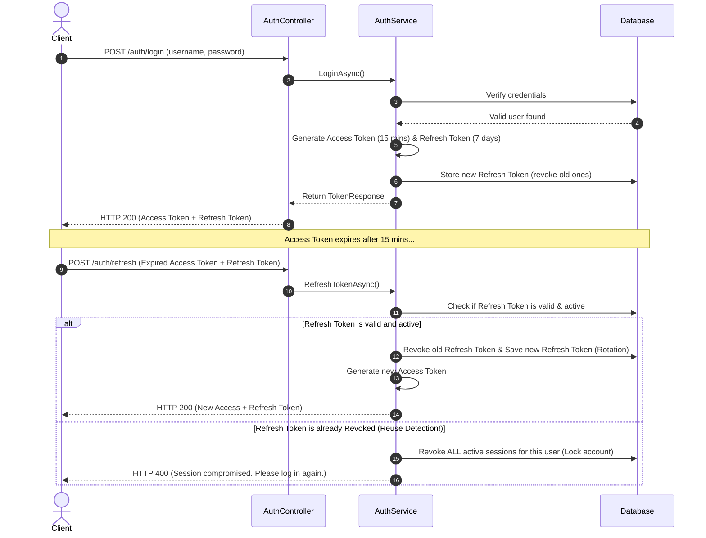

# Product Management API

A robust, enterprise-grade ASP.NET Core 8 Web API solution designed for managing products and their associated items. This project incorporates Clean Architecture principles, automated EF Core migrations, Role-Based Access Control (RBAC), and JWT-based authentication with token rotation.

---

## 📖 Table of Contents
1. [OpenAPI / Swagger Documentation](#-openapi--swagger-documentation)
2. [Code Documentation (JSDoc / XML equivalent)](#-code-documentation-jsdoc--xml-equivalent)
3. [Authentication Flow (High Level)](#-authentication-flow-high-level)
4. [Environment Setup](#%EF%B8%8F-environment-setup)
5. [Deployment Procedures](#-deployment-procedures)

---

## 🔌 OpenAPI / Swagger Documentation

The API integrates **Swashbuckle.AspNetCore** to generate interactive OpenAPI v3 specification documentation.

### Accessing Swagger UI
* **Development & Production:** Swagger is configured to run in both environments and can be accessed at:
  ```
  https://localhost:<port>/swagger/index.html
  ```
* **Security Integration:** Swagger UI includes a **Bearer Token Authorize button**. You can authenticate by clicking "Authorize" and entering `Bearer <your_access_token>`.

### Generating XML Documentation
The API project is configured to compile class and endpoint triple-slash XML comments directly into a schema file, which Swagger UI reads to output rich description fields:
* **Configuration:** Enabled in [Product.Api.csproj](file:///e:/SushilKumar_Kuchame/ProductManagement/src/Product.Api/Product.Api.csproj) via `<GenerateDocumentationFile>true</GenerateDocumentationFile>`.
* **Swagger Integration:** Wired in [ServiceExtensions.cs](file:///e:/SushilKumar_Kuchame/ProductManagement/src/Product.Api/Extensions/ServiceExtensions.cs#L101-L141) to dynamically locate the generated XML file and bind comments to matching routes.

---

## 📝 Code Documentation (JSDoc / XML Equivalent)

Because this is a back-end C# codebase (with no JavaScript or TypeScript files), standard **.NET XML Documentation Comments** are used in place of JSDoc comments. 

Both patterns serve identical purposes—providing structured code comments for automatic documentation generation:

| Feature | JSDoc (JavaScript/TypeScript) | C# XML Comments (.NET) |
|---|---|---|
| **Syntax** | `/** Description */` | `/// <summary>Description</summary>` |
| **Parameters** | `@param {type} name Description` | `<param name="name">Description</param>` |
| **Return Values** | `@returns {type} Description` | `<returns>Description</returns>` |
| **Response Type** | N/A (documented manually) | `<response code="200">Description</response>` |

### Example Implementation
Endpoints in controllers such as [AuthController.cs](file:///e:/SushilKumar_Kuchame/ProductManagement/src/Product.Api/Controllers/v1/AuthController.cs), [ProductsController.cs](file:///e:/SushilKumar_Kuchame/ProductManagement/src/Product.Api/Controllers/v1/ProductsController.cs), and [ItemsController.cs](file:///e:/SushilKumar_Kuchame/ProductManagement/src/Product.Api/Controllers/v1/ItemsController.cs) use XML documentation elements:

```csharp
/// <summary>
/// Registers a new user.
/// </summary>
/// <param name="request">The registration details (username, password, role).</param>
/// <returns>A token response with the access and refresh tokens.</returns>
/// <response code="200">User registered successfully.</response>
/// <response code="400">If the username is already taken or the input request is invalid.</response>
[HttpPost("register")]
[ProducesResponseType(typeof(TokenResponse), StatusCodes.Status200OK)]
[ProducesResponseType(StatusCodes.Status400BadRequest)]
public async Task<IActionResult> Register([FromBody] RegisterRequest request)
```

---

## 🔒 Authentication Flow (High Level)

The application utilizes JWT Bearer authentication coupled with a secure **Access/Refresh Token Rotation** strategy. 



### Key Security Safeguards
1. **Short-Lived Access Tokens:** Signed using a symmetric HMAC SHA256 key, validating critical claims such as name and role.
2. **Refresh Token Rotation (RTR):** Every time a refresh token is used, it is invalidated (marked as revoked), and a new refresh token is issued alongside the new access token.
3. **Token Reuse Detection:** If a client attempts to refresh using a previously revoked refresh token, the system assumes token theft has occurred, immediately revoking all active sessions (refresh tokens) associated with that user.
4. **Role-Based Authorization:** Secure endpoints (e.g. POST, PUT, DELETE) are annotated with `[Authorize(Roles = "Administrator")]`, ensuring that standard users cannot perform modifications.

---

## ⚙️ Environment Setup

### Prerequisites
* [.NET 8.0 SDK](https://dotnet.microsoft.com/en-us/download/dotnet/8.0)
* [Docker Desktop](https://www.docker.com/products/docker-desktop/) (recommended for containerization)
* [SQL Server](https://www.microsoft.com/en-us/sql-server/sql-server-downloads) (or LocalDB if not using Docker)

### Option A: Running via Docker Compose (Recommended)
This starts SQL Server and the API services in isolated containers, binding standard ports.

1. Navigate to the root directory containing [docker-compose.yml](file:///e:/SushilKumar_Kuchame/ProductManagement/docker-compose.yml).
2. Start the services:
   ```bash
   docker-compose up --build -d
   ```
3. The API will boot up and automatically apply database migrations on startup. Open your browser and navigate to:
   * Swagger Documentation: `http://localhost:8080/swagger`

### Option B: Local CLI Development Setup
To run the API and Database locally outside of container environments:

1. **Database Server Setup:** Ensure SQL Server is running locally. Update your connection string in [appsettings.json](file:///e:/SushilKumar_Kuchame/ProductManagement/src/Product.Api/appsettings.json) or configure it via environment variables:
   ```json
   "ConnectionStrings": {
     "DefaultConnection": "Server=localhost;Database=ProductManagementDb;Trusted_Connection=True;TrustServerCertificate=True;"
   }
   ```
2. **Apply Migrations:** Update the local database schema using Entity Framework Core tools:
   ```bash
   dotnet ef database update --project src/Product.Infrastructure --startup-project src/Product.Api
   ```
3. **Run the Application:**
   ```bash
   dotnet run --project src/Product.Api
   ```

---

## 🚀 Deployment Procedures

### 1. Containerized Deployments (Docker)
The codebase includes a multi-stage [Dockerfile](file:///e:/SushilKumar_Kuchame/ProductManagement/src/Product.Api/Dockerfile) that builds a lightweight runtime image:
* **Step 1:** Build an image using the local context:
  ```bash
  docker build -t product-api:latest -f src/Product.Api/Dockerfile .
  ```
* **Step 2:** Deploy the image to target environments like Azure Container Apps, AWS ECS, or a Kubernetes cluster.

### 2. Traditional IIS or Virtual Machine Deployments
To deploy the application to Windows IIS or web server directories:
* Publish the API using the Release configuration:
  ```bash
  dotnet publish src/Product.Api/Product.Api.csproj -c Release -o ./publish
  ```
* Configure the web server directory to point to the output folder.
* Ensure the target server has the **ASP.NET Core Runtime 8.0 Hosting Bundle** installed.

### 3. Database Migration Strategy in Production
* **Startup-based Execution:** The API contains startup code in [Program.cs](file:///e:/SushilKumar_Kuchame/ProductManagement/src/Product.Api/Program.cs#L69-L96) that automatically retries and executes database migrations during application bootstrap.
* **CI/CD Pipeline Execution (Alternative):** In critical production environments, turn off startup-based migrations and generate migration scripts during deployment pipelines using:
  ```bash
  dotnet ef migrations script --project src/Product.Infrastructure --startup-project src/Product.Api --output migration.sql
  ```
  Run `migration.sql` as a transaction within the deployment pipeline database step.
